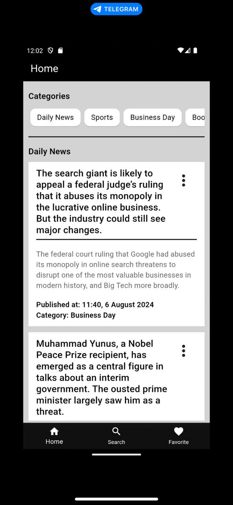
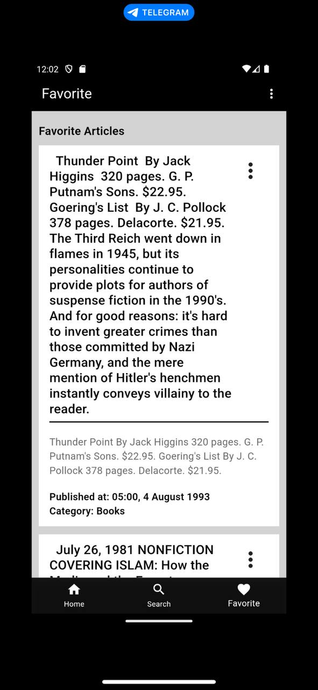
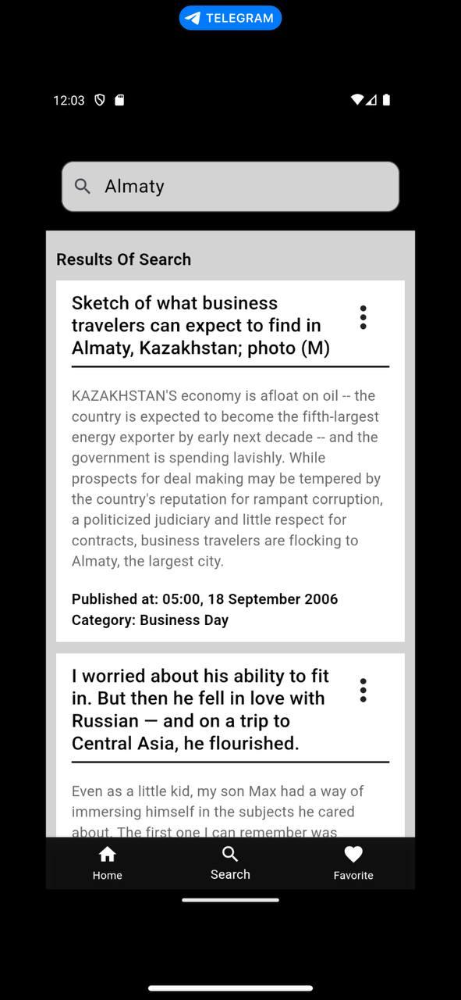

Sure, I'll update the README to include the usage of these packages.

# News App

A Flutter News App built using Test-Driven Development (TDD) and following the Clean Architecture principles. The app utilizes the `bloc` state management library, `http` for networking, `get_it` for dependency injection, and several other packages for enhanced functionality.

## Features

- **Test-Driven Development (TDD)**: Ensuring robust and maintainable code through comprehensive testing.
- **Clean Architecture**: Structured to separate concerns and promote scalability.
- **State Management**: Managed by `bloc` for predictable state handling.
- **Networking**: Uses `http` package to fetch news from APIs.
- **Dependency Injection**: Managed by `get_it` for easy and flexible dependency management.
- **Responsive UI**: Managed using `flutter_screenutil` for screen size adaptation.
- **Local Storage**: Uses `sqflite` for local database management.
- **Connectivity Check**: Uses `data_connection_checker` to check network connectivity.
- **Date and Time Formatting**: Uses `intl` for internationalization and formatting dates.
- **Functional Programming**: Uses `dartz` for functional programming paradigms and error handling.

## Getting Started

### Prerequisites

Before you begin, ensure you have met the following requirements:

- Flutter SDK: [Install Flutter](https://flutter.dev/docs/get-started/install)
- Dart SDK: Comes with Flutter
- A code editor (VS Code, Android Studio, IntelliJ IDEA, etc.)

### Installation

1. Clone the repository:

    ```bash
    git clone https://github.com/bakberdy/news_app.git
    cd news_app
    ```

2. Install the dependencies:

    ```bash
    flutter pub get
    ```

### Running the App

To run the app on your local machine:

1. Ensure a device emulator is running or a physical device is connected.
2. Use the following command:

    ```bash
    flutter run
    ```

### Running Tests

To run the tests:

```bash
flutter test
```

## Project Structure

The project follows the Clean Architecture principles, organized into the following layers:

- **Data Layer**: Manages data retrieval from APIs, local storage, etc.
- **Domain Layer**: Contains business logic, including use cases and entities.
- **Presentation Layer**: Handles UI and user interaction, managed by `bloc`.

### Key Directories

- lib/: Main directory containing the application code.
  - src/:
        - features/: Features directory divides app by features
              - data/: Data sources, models, and repositories.
              - domain/: Entities, use cases, and repositories interfaces.
              - presentation/: UI widgets, pages, and BLoC components.
        - core/: Common utilities, constants, and error handling.
  - injection_container.dart: Configures dependency injection.

## Used Packages

- **[flutter_screenutil](https://pub.dev/packages/flutter_screenutil)**: Responsive design for screen size adaptation.
- **[sqflite](https://pub.dev/packages/sqflite)**: SQLite plugin for Flutter for local database management.
- **[data_connection_checker](https://pub.dev/packages/data_connection_checker)**: Checks for an active internet connection.
- **[intl](https://pub.dev/packages/intl)**: Internationalization and localization support.
- **[dartz](https://pub.dev/packages/dartz)**: Functional programming in Dart.
- **[bloc](https://bloclibrary.dev/#/)**: State management library.
- **[http](https://pub.dev/packages/http)**: A composable, future-based library for making HTTP requests.
- **[get_it](https://pub.dev/packages/get_it)**: Simple and flexible dependency injection.

Below are some screenshots of the app:

### Home Screen


### News Details Screen


### Settings Screen


## Resources

- [Flutter Documentation](https://docs.flutter.dev/)
- [Bloc Package Documentation](https://bloclibrary.dev/#/)
- [Clean Architecture in Flutter](https://resocoder.com/2020/03/09/flutter-clean-architecture-tdd-dart/)

## Contributing

Contributions are welcome! Please fork the repository and create a pull request with your changes. For major changes, please open an issue first to discuss what you would like to change.

## License

This project is licensed under the MIT License - see the [LICENSE](LICENSE) file for details.

---

This README provides a structured overview of the project, detailing how to get started, the project's architecture, the packages used, and additional resources for development. Feel free to customize it further to fit your specific project needs.
